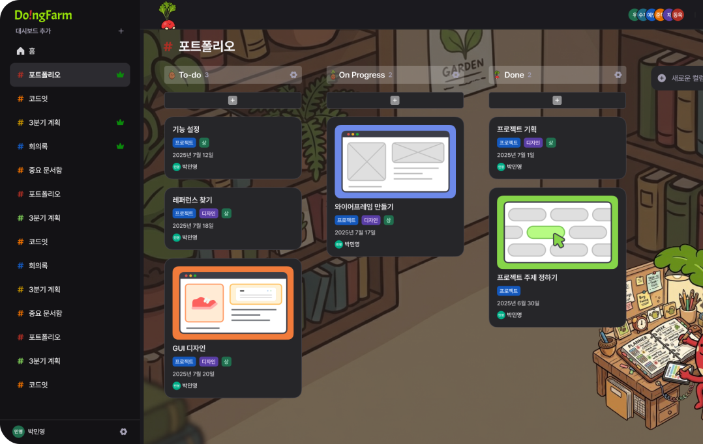
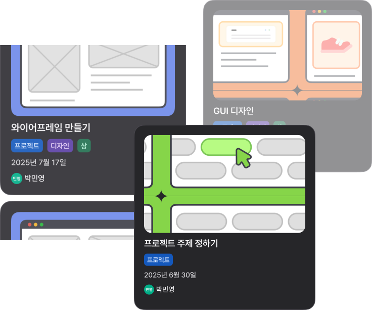
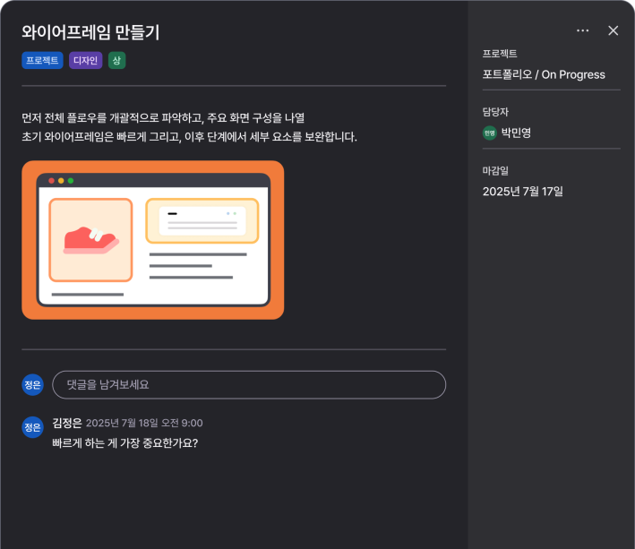
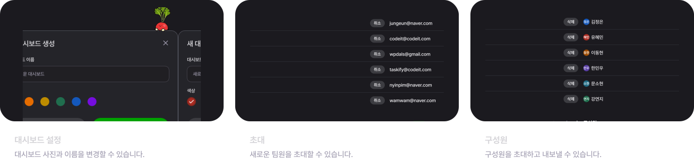

<p align="center">
  
</p>

<h1 align="center">Do!ngFarm</h1>

<p align="center">
  대시보드와 작업 보드로 팀의 할 일을 함께 가꾸는 일정 관리 서비스
</p>

<p align="center">
  
  
  
  
  
</p>

<p align="center">
  
</p>

Do!ngFarm은 대시보드별로 구성원을 초대하고, 컬럼과 할 일 카드를 만들며, 카드 상세 정보와 댓글을 통해 작업 흐름을 한곳에서 확인할 수 있는 협업형 일정 관리 웹 애플리케이션입니다.

## 목차

- [서비스 미리보기](#서비스-미리보기)
- [개발 기간](#개발-기간)
- [프로젝트 소개](#프로젝트-소개)
- [주요 기능](#주요-기능)
- [기술 스택](#기술-스택)
- [실행 방법](#실행-방법)
- [프로젝트 구조](#프로젝트-구조)
- [API 연동](#api-연동)
- [구현 메모](#구현-메모)

## 서비스 미리보기

<p align="center">
  
  
  
</p>

<p align="center">
  
  
  
  
</p>

## 개발 기간

2026.04.20 ~ 2026.05.09

## 프로젝트 소개

Do!ngFarm은 할 일을 단순히 나열하는 것을 넘어, 팀 단위의 작업 흐름을 대시보드 안에서 관리할 수 있도록 설계했습니다.

### 대시보드 중심 관리

프로젝트나 팀 단위로 대시보드를 만들고, 초대 받은 대시보드와 내가 만든 대시보드를 한 화면에서 확인할 수 있습니다.

### 작업 흐름 관리

컬럼을 기준으로 작업 상태를 나누고, 카드로 할 일을 관리합니다. 카드에는 담당자, 마감일, 태그, 이미지, 설명을 함께 담을 수 있습니다.

### 협업 기능

구성원 초대, 초대 수락/거절, 멤버 관리, 댓글 기능을 제공해 작업 맥락을 팀원과 함께 이어갈 수 있습니다.

### 개인 설정

프로필 이미지, 닉네임, 비밀번호를 직접 관리할 수 있고, 사이드바 너비 같은 화면 설정은 쿠키에 저장해 다시 방문해도 유지합니다.

## 주요 기능

### 사용자 플로우

- 랜딩: 서비스 소개, 로그인/회원가입 진입, 반응형 섹션
- 인증: 이메일 로그인, 회원가입, access token 저장, 인증 요청 처리
- 내 대시보드: 대시보드 목록 조회, 페이지네이션, 대시보드 생성
- 초대 받은 대시보드: 초대 목록 조회, 검색, 초대 수락/거절, 무한 스크롤
- 대시보드 상세: 컬럼 조회/생성/수정/삭제, 컬럼별 카드 목록 조회
- 할 일 카드: 카드 생성/상세 조회/수정/삭제, 담당자, 마감일, 태그, 이미지 업로드
- 댓글: 카드 상세 모달 안에서 댓글 작성, 수정, 삭제
- 대시보드 관리: 제목/색상 수정, 구성원 조회/삭제, 초대 내역 조회/취소, 대시보드 삭제
- 마이페이지: 프로필 이미지/닉네임 수정, 비밀번호 변경

### 공통 경험

- 모달, 확인 모달, 드롭다운, 입력 컴포넌트, 버튼, 아바타, 토스트, 스켈레톤 UI를 공통 컴포넌트로 구성했습니다.
- 반응형 사이드바와 모바일 오버레이를 제공하며, 사이드바 너비는 쿠키에 저장해 다시 방문해도 유지합니다.
- GitHub PR/push 이벤트를 Discord webhook으로 전달하는 API route를 포함했습니다.

## 기술 스택

| 분류               | 기술                                         |
| ------------------ | -------------------------------------------- |
| Framework          | Next.js 15 App Router                        |
| UI                 | React 19, TypeScript                         |
| Data Fetching      | Axios, Fetch API, Custom Hooks               |
| Server/Client Data | Next.js Server Components, Client Components |
| Styling            | CSS Modules, Global CSS, Design Tokens       |
| Date               | date-fns, react-datepicker                   |
| Feedback           | react-hot-toast                              |
| Quality            | ESLint, Prettier                             |

## 실행 방법

### 1. 패키지 설치

```bash
npm install
```

### 2. 환경 변수 설정

`.env.example`을 참고해 `.env.local`을 생성합니다.

```env
NEXT_PUBLIC_API_BASE_URL=
```

GitHub webhook 알림 기능을 사용할 경우 아래 값도 추가합니다.

```env
DISCORD_WEBHOOK_URL=
```

### 3. 개발 서버 실행

```bash
npm run dev
```

브라우저에서 `http://localhost:3000`으로 접속합니다.

## 스크립트

| 명령어                 | 설명               |
| ---------------------- | ------------------ |
| `npm run dev`          | 개발 서버 실행     |
| `npm run build`        | 프로덕션 빌드      |
| `npm run start`        | 빌드 결과 실행     |
| `npm run lint`         | ESLint 검사        |
| `npm run lint:fix`     | ESLint 자동 수정   |
| `npm run format`       | Prettier 포맷 적용 |
| `npm run format:check` | Prettier 포맷 검사 |

## 주요 라우트

| 경로                            | 설명                              |
| ------------------------------- | --------------------------------- |
| `/`                             | 랜딩 페이지                       |
| `/login`                        | 로그인                            |
| `/signup`                       | 회원가입                          |
| `/mydashboard`                  | 내 대시보드 및 초대 받은 대시보드 |
| `/dashboard/[dashboardId]`      | 대시보드 상세 작업 보드           |
| `/dashboard/[dashboardId]/edit` | 대시보드 관리                     |
| `/mypage`                       | 내 정보 관리                      |
| `/api/github-webhook`           | GitHub 이벤트 수신 API            |

## 프로젝트 구조

```bash
src/
  app/                       # App Router 페이지, 레이아웃, API route
    (auth)/                  # 로그인/회원가입 라우트 그룹
    (with-nav)/              # 사이드바/내비게이션이 포함된 라우트 그룹
    api/github-webhook/      # GitHub webhook route handler
  assets/                    # SVG 이미지, 아이콘, 캐릭터, 배경 리소스
  components/                # 공통 UI, 랜딩, 대시보드 기능 컴포넌트
  hooks/                     # 데이터 조회, mutation, UI 관련 custom hook
  lib/
    api/                     # Axios/Fetch 기반 API 클라이언트와 도메인별 요청 함수
    constants/               # 경로, 색상, query key 등 상수
    utils/                   # 날짜, 색상, storage, toast 등 유틸
  providers/                 # 전역 provider 영역
  styles/                    # reset, token, typography, global style
  types/                     # API 응답 및 도메인 타입
```

## API 연동

클라이언트 요청은 `src/lib/api/client.ts`의 Axios 인스턴스를 사용합니다.  
토큰은 `accessToken` 키로 localStorage와 cookie에 저장하며, 요청 interceptor에서 `Authorization` 헤더에 자동으로 추가합니다.

서버 컴포넌트에서 먼저 필요한 데이터를 가져오는 경우 `src/lib/api/serverClient.ts`를 사용합니다.  
서버 요청은 cookie에 저장된 access token을 읽어 인증 헤더를 구성하고, 캐시 없이 최신 데이터를 요청합니다.

## 구현 메모

- Next.js 16 기준의 `params: Promise<...>` 패턴을 사용하는 App Router 페이지가 포함되어 있습니다.
- 외부 카드/프로필 이미지는 `next.config.ts`의 `images.remotePatterns`에 등록된 S3 도메인을 허용합니다.
- 대시보드 상세 화면은 카드 생성, 상세 보기, 수정 모달을 같은 보드 화면 안에서 전환합니다.
- 내 대시보드 첫 화면은 서버에서 초기 대시보드 목록을 가져온 뒤 클라이언트에서 최신 목록으로 동기화합니다.
- 초대 목록과 카드/대시보드 목록은 화면 성격에 따라 페이지네이션 또는 무한 스크롤을 나누어 사용합니다.

## 마무리

Do!ngFarm은 일정 관리의 기본 흐름인 생성, 분류, 공유, 피드백을 한 화면 안에서 자연스럽게 이어지도록 구현한 프로젝트입니다.  
작업을 심고, 상태를 옮기고, 팀원과 함께 가꿔가는 경험을 목표로 했습니다.
